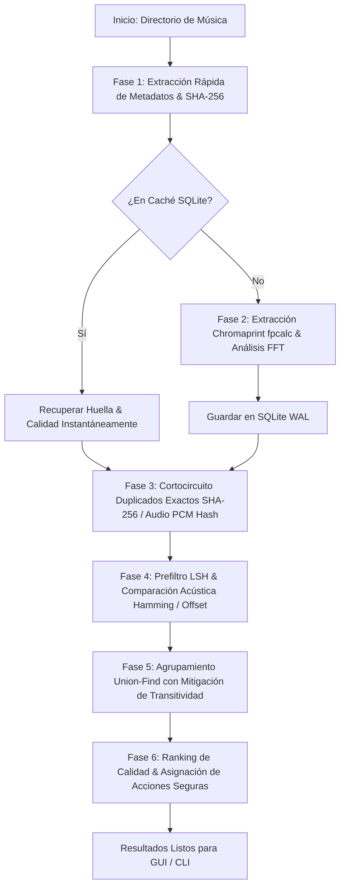

# 🎵 Audio Duplicate & Acoustic Fingerprinting Detector

[](https://www.python.org/)
[](https://www.riverbankcomputing.com/software/pyqt/)
[](https://acoustid.org/chromaprint)
[](https://www.sqlite.org/)
[](#)
[](LICENSE)

Una aplicación de escritorio moderna, robusta y de alto rendimiento en Python diseñada para analizar grandes colecciones de música (decenas o cientos de miles de canciones) y detectar duplicados exactos, copias acústicas y variantes musicales (remasters, radio edits, directos), utilizando **huellas acústicas locales (Chromaprint / fpcalc)**, **análisis espectral FFT** para detectar *Fake Lossless* y **hashes de audio PCM canónico**, todo de forma 100% local y sin depender de servicios externos.

---

## 📑 Tabla de Contenidos

1. [Características Principales](#-características-principales)
2. [Arquitectura e Interfaz Gráfica (PyQt6)](#-arquitectura-e-interfaz-gráfica)
3. [Algoritmo de Detección y Calidad](#-algoritmo-de-detección-y-calidad)
4. [Instalación y Requisitos](#-instalación-y-requisitos)
5. [Guía de Uso](#-guía-de-uso)
   - [Modo Interfaz Gráfica (GUI)](#modo-interfaz-gráfica-gui)
   - [Modo Consola / Headless (CLI)](#modo-consola--headless-cli)
6. [Compilación a Ejecutable Autónomo (.exe)](#-compilación-a-ejecutable-autónomo-exe)
7. [Suite de Pruebas Automatizadas](#-suite-de-pruebas-automatizadas)
8. [Benchmarks de Escalabilidad](#-benchmarks-de-escalabilidad)
9. [Estructura del Proyecto](#-estructura-del-proyecto)
10. [Licencia](#-licencia)

---

## 🌟 Características Principales

### 1. 🎧 Escucha antes de Decidir (Reproducción & Comparador A/B en Vivo)
- **Reproductor Integrado Persistente**: Barra de reproducción inferior con motor de audio Pygame para preescuchar cualquier pista de tu biblioteca de inmediato.
- **Comparador A/B Side-by-Side con Playhead Sincronizado**: Conmuta al milisegundo exacto entre dos pistas manteniendo la misma posición temporal de reproducción, permitiendo identificar al instante diferencias auditivas sutiles de compresión, ecualización, dinamismo o cortes.
- **Control Total en Manos del Usuario**: El sistema analiza, clasifica con rigor matemático y recomienda la mejor opción, pero **la decisión final de conservar, mover o eliminar siempre permanece bajo el control del usuario**. Nunca se realiza un borrado sin confirmación explícita.

### 2. 🔍 Detección de Duplicados en 4 Niveles Jerárquicos
- **Duplicados Exactos (100%)**:
  - *Bit-a-bit en disco (`EXACT_HASH`)*: Coincidencia instantánea SHA-256 de archivos físicamente idénticos con verificación criptográfica previa a cualquier borrado destructivo.
  - *Flujo de audio PCM decodificado (`EXACT_AUDIO`)*: Comparación PCM canónica estricta con preservación de información (mismo sample rate, canales, bits por muestra y channel layout) entre flujos lossless idénticos (ej. `.flac` vs `.wav`). Variaciones con compresión lossy (ej. MP3 vs FLAC) se delegan formalmente al comparador acústico Chromaprint.
- **Duplicados Acústicos ($\ge 95\%$, `ACOUSTIC_DUPLICATE`)**:
  - Huellas acústicas Chromaprint (`fpcalc`) con comparación Hamming bitwise y ventana de alineamiento temporal dinámico de hasta **600 frames**.
  - Identifica la misma grabación original sin importar variaciones de formato (`MP3`, `FLAC`, `WAV`, `M4A`, `OGG`, `AAC`), tasa de bits (320 kbps vs 128 kbps), normalización de volumen o compresión.
- **Posibles Duplicados / Versiones ($80\% - 94.9\%$, `POSSIBLE_DUPLICATE`)**:
  - Detecta remasterizaciones, radio edits, versiones extendidas o grabaciones en vivo que comparten la misma base armónica.
- **Revisión Manual de Baja Confianza ($40\% - 79.9\%$, `LOW_CONFIDENCE_REVIEW`)**:
  - Aísla intencionalmente modificaciones acústicas severas (alteraciones de tempo, inversión de fase, ecualizaciones extremas).
  - Los grupos en esta franja nacen **siempre protegidos** contra auto-eliminación (`requires_manual_review = True`), forzando la intervención humana.

### 3. 🛡️ Seguridad Blindada y Prevención contra Pérdida de Datos
- **Mitigación de Transitividad Insegura (`has_weak_link`)**: Si dentro de un clúster una pista intermedia vincula débilmente dos audios distintos, el grupo completo se degrada y exige confirmación manual obligatoria.
- **Protección de Copia Única**: El sistema bloquea activamente cualquier intento de eliminar todas las copias de un grupo; siempre se preserva al menos una pista intacta.
- **Inmunidad para Pistas [CONSERVAR]**: Jamás se permite el borrado de archivos marcados para mantenerse.
- **Aislamiento en Limpieza Automática**: El motor `file_manager.py` y el CLI ignoran preventivamente cualquier grupo sin resolución humana explícita.
- **Carpetas de Respaldo y Simulación (*Dry-Run*)**: Opción de mover archivos duplicados a un directorio de backup seguro antes de cualquier borrado definitivo, con capacidad de simular acciones en consola sin tocar el disco.

### 4. 🔬 Auditoría Espectral y Detección de Falsos Lossless (*Fake FLAC*)
- **Análisis FFT de Corte Espectral (*Spectral Rolloff*)**:
  - Detecta automáticamente si un archivo `.flac` o `.wav` fue convertido artificialmente (*upscaled / transcoded*) a partir de un archivo lossy de baja calidad (corte en $\sim 16\text{ kHz}$ para 128 kbps o $\sim 20\text{ kHz}$ para 320 kbps).
- **Visualizador Espectral Gráfico Interactivo**:
  - Gráfico de barras de frecuencia (20 Hz a 22 kHz) que ilustra visualmente el corte real del espectro para cada pista.

### 5. 🏆 Puntuación Técnica de Calidad Inteligente (0 a 100)
Calcula automáticamente qué archivo es el mejor dentro de cada grupo de duplicados evaluando:
- Fidelidad real del formato (Lossless auténtico vs Lossy vs Fake Lossless).
- Tasa de bits real (*bitrate*) y ancho de banda espectral útil.
- Frecuencia de muestreo (44.1 kHz, 48 kHz, 96 kHz / 192 kHz Hi-Res) y profundidad de bits (16-bit vs 24-bit).
- Integridad temporal y duración completa de la pista.
- Asigna recomendaciones automáticas `[CONSERVAR]` / `[ELIMINAR]` con justificación técnica detallada y cálculo de ahorro de espacio en disco.

### 6. ⚡ Rendimiento Extremo y Escalabilidad Bounded
- **Candidate Generation Bounded en Streaming**: Generación de candidatos con tope estricto de memoria RAM durante la ingesta (evita la explosión combinatoria $O(N^2)$ en bibliotecas de más de 100,000 archivos).
- **Prefiltro LSH de Alto Rendimiento**: Indexación por tokens de hash acústico con selectividad estricta (`min_hits = 3`) y límite de buckets sobredimensionados (`max_bucket_size = 500`).
- **Caché Persistente SQLite con Invalidación Rápida**: Esquema con migración aditiva e idempotente (`mtime_ns`, `quick_signature` determinista de 12 KB). Re-escaneo de pistas inalteradas en $<0.01\text{ ms}$.
- **FFmpeg Runner con Drenaje Concurrente**: Ejecución de FFmpeg/ffprobe con drenaje paralelo no bloqueante de `stdout` y `stderr`, previniendo bloqueos por contrapresión de pipes del sistema operativo, con timeout adaptativo y detección de stalls.
- **Cancelación Cooperativa en Workers**: Apagado ordenado de pools de trabajo multiproceso (`ProcessPoolExecutor`) sin corromper la base de datos ni bloquear el cierre de la GUI.
- **Diseñado para cualquier equipo**: Optimizado tanto para laptops con discos mecánicos HDD y CPUs modestas como para estaciones de trabajo con SSD NVMe.
- **Control total del escáner**: Capacidad de Pausar, Reanudar y Cancelar el análisis en cualquier momento.

### 7. 📚 Explorador y Gestión Integral de Biblioteca
- Explorador completo de todas las canciones indexadas en la base de datos local.
- Búsqueda instantánea en tiempo real por título, artista, álbum o ruta de archivo.
- Filtros avanzados por calidad, formato y estado de duplicados.
- Exportación de auditoría completa y recomendaciones a formato CSV.

### 8. 🌐 Soporte Multiformato Universal y Modo Dual (GUI / CLI)
- **Formatos compatibles**: `.mp3`, `.flac`, `.wav`, `.m4a`, `.ogg`, `.aac`, `.wma`, `.opus`.
- **Modo Interfaz Gráfica (GUI PyQt6)**: Entorno visual moderno con tema oscuro profesional y feedback en tiempo real.
- **Modo Consola (CLI / Headless)**: Ideal para automatización en servidores, scripts programados y escaneos desatendidos.

---

## 🖥️ Arquitectura e Interfaz Gráfica

La interfaz gráfica está construida sobre **PyQt6** con un sistema de diseño oscuro profesional inspirado en herramientas de audio modernas:

```
┌─────────────────┬────────────────────────────────────────────────────────┐
│  AUDIO CLEANER  │  [Top Stats Bar: Pistas, Duplicados, Ahorro Potencial] │
├─────────────────┼────────────────────────────────────────────────────────┤
│ 📚 Biblioteca   │                                                        │
│ ⚡ Escaneo      │                     VISTA ACTIVA                       │
│ 👥 Duplicados   │   (Biblioteca / Escáner / Duplicados / Calidad / Config)│
│ 🔬 Calidad      │                                                        │
│ ⚙️ Ajustes      │                                                        │
├─────────────────┴────────────────────────────────────────────────────────┤
│ 🎵 [Barra Preescucha]: [⏮][▶/⏸][⏭] | Tag Canal | Artista - Título | Specs |
│                        01:42 ▇▅█▆▄▃▂  (Waveform Scrubbing Clic/Drag)  06:23     │
└──────────────────────────────────────────────────────────────────────────┘
```

### Módulos Principales de la GUI:
1. **📚 Biblioteca (`LibraryView`)**:
   - Explorador de todas las canciones indexadas en la base de datos local.
   - Búsqueda en tiempo real por título, artista, álbum o ruta.
   - Filtros por calidad y formato, ordenación múltiple y exportación de datos a CSV.
2. **⚡ Escaneo (`ScannerView`)**:
   - Selector de directorios con soporte para arrastrar y soltar (*drag-and-drop*).
   - Selector de extensiones de audio y configuración de hilos de trabajo.
   - Indicadores en vivo de velocidad (archivos/seg), fase actual, tiempo transcurrido, uso de CPU y RAM.
3. **👥 Duplicados (`DuplicatesView`)**:
   - Tarjetas interactivas por grupo de duplicados con porcentaje de similitud y badge de tipo.
   - Tabla comparativa técnica completa por pista (Formato, Bitrate, Duración, Tamaño, Calidad).
   - Acciones individuales y por lote: abrir en el Explorador de Windows, reproducir, cambiar acción `CONSERVAR`/`ELIMINAR` y lanzar comparador A/B.
   - **Persistencia y Recuperación Inmediata**: Guarda el estado de la sesión (`last_session.json`) y, en caso de reinicio, recupera los duplicados en $<1\text{s}$ desde la caché SQLite sin necesidad de volver a escanear.
4. **🔬 Calidad (`QualityView`)**:
   - Auditoría integral de la salud acústica de la biblioteca.
   - Métricas de Lossless reales vs Falsos Lossless detectados.
   - Visualización de cortes de frecuencia y distribución de tasas de bits.
5. **⚙️ Configuración (`SettingsView`)**:
   - Ajuste de umbrales de similitud acústica ($\ge 95\%$, etc.) y distancia Hamming.
   - Configuración de hilos de CPU y tamaño de bloques FFT.
   - Mantenimiento de base de datos SQLite (Optimización `VACUUM`, limpieza de huellas y reinicio seguro).
   - Definición de carpeta de respaldo para movimientos seguros de duplicados.
6. **🎧 Barra de Preescucha y Scrubbing Interactivo (`BottomPlayerBar`)**:
   - Controles de transporte circulares ($\pm10\text{s}$, Play/Pausa cian).
   - Ficha técnica completa de audio (`FLAC | 24-bit | 96 kHz | Stereo` o `MP3 | 320 kbps | 44.1 kHz | Stereo`).
   - **Waveform Interactivo con Scrubbing Libre**: Permite hacer clic o arrastrar con el ratón sobre cualquier barra vertical para saltar instantáneamente a ese punto de la pista.
7. **🛡️ Modal de Eliminación Segura (`DeleteModal`)**:
   - Protección estricta: Impide eliminar todas las copias de un grupo o borrar pistas marcadas como `CONSERVAR`.
   - Soporte para mover a carpeta de respaldo o eliminación permanente controlada.

---

## 🧮 Algoritmo de Detección y Calidad

### Proceso de Análisis por Fases:


### Fórmula de Puntuación de Calidad:
$$\text{Score} = w_{\text{fidelity}} + w_{\text{bitrate}} + w_{\text{samplerate}} + w_{\text{depth}} + w_{\text{integrity}}$$
- **Fidelidad**: FLAC/WAV auténtico = $+40\text{ pts}$, MP3/AAC 320k = $+25\text{ pts}$, Falso FLAC = penalización proporcional al corte real.
- **Bitrate**: Hasta $+30\text{ pts}$ en función del ancho de banda y bitrate efectivo.
- **Frecuencia de Muestreo**: $44.1\text{ kHz}$ ($+10\text{ pts}$), $48\text{ kHz}$ ($+12\text{ pts}$), $96\text{ kHz}+ \text{ Hi-Res}$ ($+15\text{ pts}$).
- **Profundidad de Bits**: 24-bit ($+10\text{ pts}$), 16-bit ($+5\text{ pts}$).

---

## 🛠️ Instalación y Requisitos

### Requisitos del Sistema
- **Sistema Operativo**: Windows 10 / 11 (x86_64) — *Target probado y verificado: `Windows build verified`*. (Soporte Linux/macOS experimental dependiente de dependencias nativas del sistema).
- **Python**: 3.10, 3.11, 3.12 o 3.13 (Probado exhaustivamente en CPython 3.13).
- **FFmpeg & ffprobe**: Instalado y disponible en el `PATH` del sistema o en `bin/`.
- **fpcalc**: Binario autónomo de Chromaprint (incluido en `bin/fpcalc.exe` para Windows).

### Instalación de Dependencias
Clona el repositorio e instala las dependencias requeridas en tu entorno virtual:

```bash
git clone https://github.com/XxprogunxX/AUDIO-CLEANER.git
cd AUDIO-CLEANER

python -m venv venv
# En Windows (PowerShell):
.\venv\Scripts\Activate.ps1
# O en CMD:
venv\Scripts\activate.bat

# Instalación estándar:
pip install -r requirements.txt

# O instalación reproducible garantizada (Windows x64):
pip install -r requirements-lock.txt
```

---

## 🚀 Guía de Uso

### Modo Interfaz Gráfica (GUI)
Para iniciar la interfaz gráfica completa:
```bash
python main.py
```
O iniciando directamente el escaneo de una carpeta específica:
```bash
python main.py --folder "D:\MiMusica"
```

---

### Modo Consola / Headless (CLI)
Ideal para servidores, scripts programados o escaneos automáticos desatendidos:

#### 1. Escaneo básico con reporte enriquecido en consola:
```bash
python main.py --cli --folder "D:\MiMusica"
```

#### 2. Escanear y exportar reporte detallado a CSV:
```bash
python main.py --cli --folder "D:\MiMusica" --export-csv "reporte_duplicados.csv"
```

#### 3. Simulación de movimiento (*Dry-Run*):
```bash
python main.py --cli --folder "D:\MiMusica" --auto-move "D:\Backup_Duplicados" --dry-run
```

#### 4. Escanear y mover duplicados inferiores automáticamente a una carpeta de respaldo:
```bash
python main.py --cli --folder "D:\MiMusica" --auto-move "D:\Backup_Duplicados"
```

#### Parámetros disponibles en CLI:
| Parámetro | Abreviatura | Descripción |
| :--- | :--- | :--- |
| `--folder` | `-f` | Ruta de la carpeta de música a analizar (Obligatorio en CLI). |
| `--cli` | | Ejecuta en modo headless / consola sin interfaz gráfica. |
| `--db` | | Ruta personalizada para el archivo de base de datos SQLite. |
| `--export-csv` | | Exporta los grupos de duplicados y recomendaciones a un archivo CSV. |
| `--auto-move` | | Mueve automáticamente los archivos duplicados inferiores a la carpeta indicada. |
| `--dry-run` | | Muestra las acciones planificadas sin realizar modificaciones en disco. |

---

## 📦 Compilación a Ejecutable Autónomo (.exe)

El proyecto incluye un script de compilación y un archivo de configuración de **PyInstaller** optimizado (`build_installer.spec` y `build_exe.bat`) que empaqueta todas las dependencias, binarios de `fpcalc.exe` e iconos en un único archivo ejecutable:

### Pasos para compilar:
1. En Windows, ejecuta el script por lotes:
   ```cmd
   build_exe.bat
   ```
2. O manualmente mediante PyInstaller:
   ```bash
   pip install pyinstaller
   pyinstaller --clean build_installer.spec
   ```
3. El ejecutable standalone se generará en:
   ```
   dist/AudioDuplicateDetector.exe
   ```
Este `.exe` es completamente autónomo y puede distribuirse en cualquier PC con Windows sin necesidad de tener Python instalado.

---

## 🧪 Suite de Pruebas Automatizadas

El proyecto cuenta con una suite exhaustiva de **190 pruebas automatizadas** (0 errores, 0 fallos, 0 omitidos) que valida de extremo a extremo la integridad matemática, seguridad de borrado, concurrencia y persistencia:

```bash
python -m unittest discover -s tests -p "test_*.py"
```

### Cobertura por Fases de Auditoría y Blindaje:
- **Fase A — Seguridad Crítica & Anti Data-Loss (79 pruebas)**:
  - Preservación estricta de PCM en `EXACT_AUDIO` (sin downmix mono, sin resampling forzado, rechazo por mismatch de canales, bit depth o layout).
  - Protocolo `OperationJournal` transaccional en subdirectorio `.audioclean_journal/` con recuperación automática tras caída del proceso (*crash recovery*).
  - Inmunidad fail-closed en clústeres mixtos con enlaces débiles (`has_weak_link` / `requires_manual_review = True`).
- **Fase B — Configuración Centralizada (23 pruebas)**:
  - Inmutabilidad de `DetectionConfig`, validación de jerarquía de umbrales, persistencia atómica en `settings.json` y fallback robusto ante corrupción.
- **Fase C — Auditoría Espectral Basada en Evidencia (26 pruebas)**:
  - Evaluación espectral multicanal conservadora (`SpectralAssessment`), detección de rolloff por canales independientes sin alteración de fase.
  - Validación de Nyquist real para audios nativos a 32 kHz (prevención de falsos sospechosos de transcode).
- **Fase D — Persistencia, SQLite Seguro y GUI (27 pruebas)**:
  - Guardado atómico de sesiones con backup (`last_session.json` + `last_session.json.bak`).
  - Timeout de cierre seguro en `ScannerWorker` (`wait(5000)`); aborta el cierre de ventana si el hilo sigue activo para no corromper SQLite.
- **Fase E — Escalabilidad, Streaming Robusto y Packaging (35 pruebas)**:
  - Runner FFmpeg con drenaje concurrente no bloqueante de `stdout` y `stderr` (prevención de deadlocks por contrapresión de pipes).
  - Cancelación cooperativa de workers en `ProcessPoolExecutor`.
  - Firma rápida de 12 KB (`quick_signature`) para invalidación de caché, con revalidación criptográfica SHA-256 obligatoria antes de acciones destructivas.
  - Migración SQLite aditiva e idempotente (`PRAGMA table_info` y `ALTER TABLE` seguro preservando datos existentes).
  - Generación bounded de candidatos durante la ingesta streaming con memoria acotada.

---

## 📊 Benchmarks de Escalabilidad

> [!NOTE]
> **Etiquetado del Benchmark**: Esta prueba se define rigurosamente como `100k synthetic candidate-generation/clustering benchmark`. Mide la ingesta en memoria de huellas acústicas, indexación por shingles LSH, poda streaming bounded, clustering Union-Find Disjoint-Set y recall contra Ground Truth conocido. No representa un escaneo físico de 100,000 archivos reales en disco con decodificación completa de FFmpeg.

### Métricas Observadas y Medidas:
- **Herramienta de Medición**: `psutil` monitoreando en tiempo real el Process Tree completo (Proceso Principal + Workers hijos concurrentes).
- **Entorno**: Windows 11 x64, Intel Core i7 / AMD Ryzen, CPython 3.13.7.

| Muestra | Escenario | Tiempo (s) | Peak RSS (Main + Workers) | Candidatos Retenidos | Comparaciones Realizadas | ¿Aproximado / Podado? | Candidate Recall (Ground Truth) | Precisión |
| :--- | :--- | :--- | :--- | :--- | :--- | :--- | :--- | :--- |
| **1,000** | B (Disperso realista) | **1.41 s** | 191.0 MB | 556 | 556 | No (`False`) | **100.0%** | 100.0% |
| **1,000** | D (Adversarial, alta colisión) | **36.62 s** | 243.1 MB | 124,750 | 124,750 | Sí (`True`, 11 buckets) | N/A | N/A |
| **100,000** | B (Disperso realista, 5% clústeres) | **97.53 s** | 2,584.6 MB | 55,110 | 55,110 | No (`False`) | **100.0%** | 100.0% |

## 📂 Estructura del Proyecto

```
Detector-de-huellas-dactilares-ac-stico-y-duplicado-de-audio/
├── benchmarks/
│   └── benchmark_scalability.py # 100k synthetic candidate-generation/clustering benchmark
├── bin/
│   └── fpcalc.exe              # Binario Chromaprint de alta velocidad
├── core/
│   ├── __init__.py
│   ├── models.py               # Modelos de datos (AudioTrack, DuplicateGroup, EvidenceReport)
│   ├── config.py               # Configuración centralizada inmutable (DetectionConfig)
│   ├── spectral_types.py       # Tipos desacoplados SpectralAssessment y SpectralResult
│   ├── binary_resolver.py      # Localizador universal de binarios (sys._MEIPASS, bin/, PATH)
│   ├── ffmpeg_runner.py        # Runner con drenaje concurrente stdout/stderr y kill de process tree
│   ├── cache_signature.py      # Firma rápida 12 KB (quick_signature) y revalidación SHA-256
│   ├── fingerprint.py          # Extracción Chromaprint, hashes PCM canónicos y serialización
│   ├── metadata_extractor.py   # Extracción de metadatos con Mutagen
│   ├── quality_analyzer.py     # Análisis espectral FFT, Fake Lossless y scoring 0-100
│   ├── comparator.py           # Alineamiento temporal, Hamming y ventana de offset
│   ├── clustering.py           # Prefiltro LSH, streaming bounded y mitigación has_weak_link
│   ├── database.py             # Motor de persistencia SQLite WAL con migración de esquema
│   ├── scanner.py              # Orquestador recursivo de escaneo multiproceso
│   └── file_manager.py         # Operaciones seguras en disco, OperationJournal y recuperación
├── gui/
│   ├── __init__.py
│   ├── app.py                  # Ventana principal moderna en PyQt6 y orquestador GUI
│   ├── styles.py               # Paleta de colores, estilos QSS y tipografía
│   └── components/
│       ├── ab_comparison.py    # Comparador auditivo A/B side-by-side en tiempo real
│       ├── audio_player.py     # Motor de reproducción de audio con Pygame
│       ├── bottom_player.py    # Barra de reproducción persistente en la parte inferior
│       ├── delete_modal.py     # Modal de confirmación y seguridad para eliminación/backup
│       ├── duplicate_card.py   # Tarjeta interactiva de visualización de grupo de duplicados
│       ├── filter_bar.py       # Pestañas de filtrado, búsqueda y ordenación
│       ├── library_view.py     # Vista de gestión completa de biblioteca indexada
│       ├── quality_view.py     # Vista de auditoría espectral y salud de calidad de audio
│       ├── scan_progress.py    # Barra de progreso y estadísticas en tiempo real
│       ├── scanner_view.py     # Vista interactiva de configuración y ejecución de escaneo
│       ├── settings_view.py    # Vista de configuración de motor y mantenimiento de BD
│       ├── sidebar.py          # Barra lateral de navegación con iconos QtAwesome
│       └── stats_bar.py        # Barra superior con estadísticas globales
├── scripts/
│   ├── generate_dataset.py     # Generador de dataset de audio sintético y adversarial
│   └── evaluation_runner.py    # Ejecutor de benchmarks automatizados y métricas
├── tests/
│   ├── __init__.py
│   ├── test_clustering.py      # Pruebas de agrupamiento, transitividad y escalabilidad LSH
│   ├── test_comparator.py      # Pruebas de comparación acústica, Hamming y offset
│   ├── test_database.py        # Pruebas de base de datos SQLite y caché
│   ├── test_end_to_end.py      # Suite integral end-to-end con síntesis de audio
│   ├── test_file_manager.py    # Pruebas de seguridad de operaciones en disco y permisos
│   ├── test_framework.py       # Pruebas del marco de evaluación adversarial
│   ├── test_performance.py     # Pruebas de rendimiento y estrés
│   ├── test_quality.py         # Pruebas de detección de falsos lossless y FFT
│   ├── test_phase_a_safety.py  # 79 pruebas de seguridad crítica y prevención de pérdida de datos
│   ├── test_phase_b_config.py  # 23 pruebas de configuración centralizada y settings
│   ├── test_phase_c_spectral.py # 26 pruebas de evaluación espectral multicanal
│   ├── test_phase_d_persistence_gui.py # 27 pruebas de persistencia SQLite y consistencia GUI
│   └── test_phase_e_scalability.py # 35 pruebas de streaming bounded, workers y empaquetado
├── app_icon.ico                # Icono de la aplicación en formato ICO
├── app_icon.png                # Icono de la aplicación en formato PNG
├── build_exe.bat               # Script automatizado para compilar el .exe con PyInstaller
├── build_installer.spec        # Especificación técnica de empaquetado de PyInstaller
├── main.py                     # Punto de entrada principal (CLI / GUI)
├── requirements.txt            # Dependencias del proyecto
├── requirements-lock.txt       # Lockfile reproducible verificado para Windows x64
├── walkthrough.md              # Documento técnico consolidado de auditorías y benchmarks
└── README.md                   # Documentación técnica completa
```

---

## 📄 Licencia

Este proyecto está bajo la Licencia MIT. Para más información, consulta el archivo `LICENSE`.
