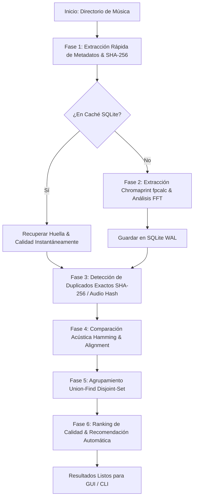

# 🎵 Audio Duplicate & Acoustic Fingerprinting Detector

[](https://www.python.org/)
[](https://www.riverbankcomputing.com/software/pyqt/)
[](https://acoustid.org/chromaprint)
[](https://www.sqlite.org/)
[](#)
[](LICENSE)

Una aplicación de escritorio moderna, robusta y de alto rendimiento en Python diseñada para analizar grandes colecciones de música (decenas o cientos de miles de canciones) y detectar duplicados exactos, copias acústicas y variantes musicales (remasters, radio edits, directos), utilizando **huellas acústicas locales (Chromaprint / fpcalc)**, **análisis espectral FFT** para detectar *Fake Lossless* y **hashes de audio PCM**, todo de forma 100% local y sin depender de servicios externos.

---

## 📑 Tabla de Contenidos

1. [Características Principales](#-características-principales)
2. [Arquitectura e Interfaz Gráfica (PyQt6)](#-arquitectura-e-interfaz-gráfica)
3. [Algoritmo de Detección y Calidad](#-algoritmo-de-detección-y-calidad)
4. [Instalación y Requisitos](#-instalación-y-requisitos)
5. [Guía de Uso](#-guía-de-uso)
   - [Modo Interfaz Gráfica (GUI)](#modo-interfaz-gráfica-gui)
   - [Modo Consola / Headless (CLI)](#modo-consola--headless-cli)
6. [Compilación a Ejecutable Autónomo (.exe)](#-compilación-a-ejecutable-autónomo-exe)
7. [Suite de Pruebas Automatizadas](#-suite-de-pruebas-automatizadas)
8. [Estructura del Proyecto](#-estructura-del-proyecto)
9. [Licencia](#-licencia)

---

## 🌟 Características Principales

### 1. 🔍 Detección de Duplicados en 3 Niveles Jerárquicos
- **Duplicados Exactos (100%)**:
  - *Bit-a-bit en disco (SHA-256)*: Detección instantánea de copias idénticas.
  - *Flujo de audio PCM decodificado*: Identifica canciones idénticas con diferentes etiquetas ID3, metadatos o contenedores (`.mp3` vs `.wav` con audio idéntico).
- **Duplicados Acústicos ($\ge 95\%$)**:
  - Huellas acústicas Chromaprint (`fpcalc`) con comparación de distancia de Hamming bitwise y alineamiento temporal dinámico.
  - Detecta la misma pista/grabación original sin importar el formato (`MP3`, `FLAC`, `WAV`, `M4A`, `OGG`, `AAC`), la tasa de bits (320 kbps vs 128 kbps), normalizaciones de volumen o compresión.
- **Posibles Duplicados / Versiones ($80\% - 94.9\%$)**:
  - Identifica remasterizaciones, radio edits, versiones extendidas o directos que comparten la misma estructura armónica.
- **Cero Falsos Positivos**:
  - Agrupamiento matemático riguroso mediante conjuntos disjuntos (*Disjoint-Set Union / Union-Find*). Canciones distintas del mismo artista jamás se agrupan juntas.

### 2. 🔬 Auditoría Espectral y Detección de Falsos Lossless (*Fake FLAC*)
- **Análisis FFT de Corte Espectral (*Spectral Rolloff*)**:
  - Detecta automáticamente si un archivo `.flac` o `.wav` fue convertido artificialmente (*upscaled / transcoded*) a partir de un archivo lossy de baja calidad (corte en $\sim 16\text{ kHz}$ para 128 kbps o $\sim 20\text{ kHz}$ para 320 kbps).
- **Visualizador Espectral Gráfico**:
  - Gráfico interactivo de barras espectrales (20 Hz a 22 kHz) que ilustra visualmente el corte de frecuencias reales de cada pista.

### 3. 🏆 Puntuación Técnica de Calidad Inteligente (0 a 100)
Calcula automáticamente qué archivo es el mejor dentro de cada grupo de duplicados evaluando:
- Fidelidad real del formato (Lossless auténtico vs Lossy vs Fake Lossless).
- Tasa de bits real (*bitrate*) y ancho de banda espectral útil.
- Frecuencia de muestreo (44.1 kHz, 48 kHz, 96 kHz / 192 kHz Hi-Res) y profundidad de bits (16-bit vs 24-bit).
- Integridad temporal y duración completa de la pista.
- Asigna recomendaciones automáticas `[CONSERVAR]` / `[ELIMINAR]` con justificación técnica detallada.

### 4. 🎚️ Comparador A/B Side-by-Side en Tiempo Real
- Permite comparar instantáneamente dos pistas lado a lado.
- **Conmutación continua A/B**: Alterna entre la Pista A y la Pista B manteniendo exactamente la misma posición de reproducción (*playhead*), ideal para evaluar diferencias auditivas de compresión y ecualización.

### 5. ⚡ Rendimiento Extremo para Colecciones Gigantes
- **Caché persistente SQLite con modo WAL (Write-Ahead Logging)**: Re-escaneo de archivos inalterados en $0.01\text{ ms}$.
- **Procesamiento paralelo multi-núcleo**: Decodificación y extracción de huellas acústicas simultánea en todos los hilos de CPU disponibles.
- **Control total del escáner**: Capacidad de Pausar, Reanudar y Cancelar el análisis en cualquier momento.

---

## 🖥️ Arquitectura e Interfaz Gráfica

La interfaz gráfica está construida sobre **PyQt6** con un sistema de diseño oscuro profesional inspirado en herramientas de audio modernas:

```
┌─────────────────┬────────────────────────────────────────────────────────┐
│  AUDIO CLEANER  │  [Top Stats Bar: Pistas, Duplicados, Ahorro Potencial] │
├─────────────────┼────────────────────────────────────────────────────────┤
│ 📚 Biblioteca   │                                                        │
│ ⚡ Escaneo      │                     VISTA ACTIVA                       │
│ 👥 Duplicados   │   (Biblioteca / Escáner / Duplicados / Calidad / Config)│
│ 🔬 Calidad      │                                                        │
│ ⚙️ Ajustes      │                                                        │
├─────────────────┴────────────────────────────────────────────────────────┤
│ 🎵 [Bottom Player Bar]: Carátula | Info Pista | Barra Progreso | Volumen  │
└──────────────────────────────────────────────────────────────────────────┘
```

### Módulos Principales de la GUI:
1. **📚 Biblioteca (`LibraryView`)**:
   - Explorador de todas las canciones indexadas en la base de datos local.
   - Búsqueda en tiempo real por título, artista, álbum o ruta.
   - Filtros por calidad y formato, ordenación múltiple y exportación de datos a CSV.
2. **⚡ Escaneo (`ScannerView`)**:
   - Selector de directorios con soporte para arrastrar y soltar (*drag-and-drop*).
   - Selector de extensiones de audio y configuración de hilos de trabajo.
   - Indicadores en vivo de velocidad (archivos/seg), fase actual, tiempo transcurrido, uso de CPU y RAM.
3. **👥 Duplicados (`DuplicatesView`)**:
   - Tarjetas interactivas por grupo de duplicados con porcentaje de similitud y badge de tipo.
   - Tabla comparativa técnica completa por pista (Formato, Bitrate, Duración, Tamaño, Calidad).
   - Acciones individuales y por lote: abrir en el Explorador de Windows, reproducir, cambiar acción `CONSERVAR`/`ELIMINAR` y lanzar comparador A/B.
4. **🔬 Calidad (`QualityView`)**:
   - Auditoría integral de la salud acústica de la biblioteca.
   - Métricas de Lossless reales vs Falsos Lossless detectados.
   - Visualización de cortes de frecuencia y distribución de tasas de bits.
5. **⚙️ Configuración (`SettingsView`)**:
   - Ajuste de umbrales de similitud acústica ($\ge 95\%$, etc.) y distancia Hamming.
   - Configuración de hilos de CPU y tamaño de bloques FFT.
   - Mantenimiento de base de datos SQLite (Optimización `VACUUM`, limpieza de huellas y reinicio seguro).
   - Definición de carpeta de respaldo para movimientos seguros de duplicados.
6. **🛡️ Modal de Eliminación Segura (`DeleteModal`)**:
   - Protección estricta: Impide eliminar todas las copias de un grupo o borrar pistas marcadas como `CONSERVAR`.
   - Soporte para mover a carpeta de respaldo o eliminación permanente controlada.

---

## 🧮 Algoritmo de Detección y Calidad

### Proceso de Análisis por Fases:


### Fórmula de Puntuación de Calidad:
$$\text{Score} = w_{\text{fidelity}} + w_{\text{bitrate}} + w_{\text{samplerate}} + w_{\text{depth}} + w_{\text{integrity}}$$
- **Fidelidad**: FLAC/WAV auténtico = $+40\text{ pts}$, MP3/AAC 320k = $+25\text{ pts}$, Falso FLAC = penalización proporcional al corte real.
- **Bitrate**: Hasta $+30\text{ pts}$ en función del ancho de banda y bitrate efectivo.
- **Frecuencia de Muestreo**: $44.1\text{ kHz}$ ($+10\text{ pts}$), $48\text{ kHz}$ ($+12\text{ pts}$), $96\text{ kHz}+ \text{ Hi-Res}$ ($+15\text{ pts}$).
- **Profundidad de Bits**: 24-bit ($+10\text{ pts}$), 16-bit ($+5\text{ pts}$).

---

## 🛠️ Instalación y Requisitos

### Requisitos del Sistema
- **Sistema Operativo**: Windows 10 / 11, Linux o macOS.
- **Python**: 3.10 o superior.
- **FFmpeg**: Instalado y disponible en el `PATH` del sistema.
- **fpcalc**: Binario autónomo de Chromaprint (incluido en `bin/fpcalc.exe` para Windows).

### Instalación de Dependencias
Clona el repositorio e instala las dependencias requeridas en tu entorno virtual:

```bash
git clone https://github.com/XxprogunxX/Detector-de-huellas-dactilares-ac-stico-y-duplicado-de-audio.git
cd Detector-de-huellas-dactilares-ac-stico-y-duplicado-de-audio

python -m venv venv
# En Windows:
venv\Scripts\activate
# En Linux/macOS:
source venv/bin/activate

pip install -r requirements.txt
```

---

## 🚀 Guía de Uso

### Modo Interfaz Gráfica (GUI)
Para iniciar la interfaz gráfica completa:
```bash
python main.py
```
O iniciando directamente el escaneo de una carpeta específica:
```bash
python main.py --folder "D:\MiMusica"
```

---

### Modo Consola / Headless (CLI)
Ideal para servidores, scripts programados o escaneos automáticos desatendidos:

#### 1. Escaneo básico con reporte enriquecido en consola:
```bash
python main.py --cli --folder "D:\MiMusica"
```

#### 2. Escanear y exportar reporte detallado a CSV:
```bash
python main.py --cli --folder "D:\MiMusica" --export-csv "reporte_duplicados.csv"
```

#### 3. Simulación de movimiento (*Dry-Run*):
```bash
python main.py --cli --folder "D:\MiMusica" --auto-move "D:\Backup_Duplicados" --dry-run
```

#### 4. Escanear y mover duplicados inferiores automáticamente a una carpeta de respaldo:
```bash
python main.py --cli --folder "D:\MiMusica" --auto-move "D:\Backup_Duplicados"
```

#### Parámetros disponibles en CLI:
| Parámetro | Abreviatura | Descripción |
| :--- | :--- | :--- |
| `--folder` | `-f` | Ruta de la carpeta de música a analizar (Obligatorio en CLI). |
| `--cli` | | Ejecuta en modo headless / consola sin interfaz gráfica. |
| `--db` | | Ruta personalizada para el archivo de base de datos SQLite. |
| `--export-csv` | | Exporta los grupos de duplicados y recomendaciones a un archivo CSV. |
| `--auto-move` | | Mueve automáticamente los archivos duplicados inferiores a la carpeta indicada. |
| `--dry-run` | | Muestra las acciones planificadas sin realizar modificaciones en disco. |

---

## 📦 Compilación a Ejecutable Autónomo (.exe)

El proyecto incluye un script de compilación y un archivo de configuración de **PyInstaller** optimizado (`build_installer.spec` y `build_exe.bat`) que empaqueta todas las dependencias, binarios de `fpcalc.exe` e iconos en un único archivo ejecutable:

### Pasos para compilar:
1. En Windows, ejecuta el script por lotes:
   ```cmd
   build_exe.bat
   ```
2. O manualmente mediante PyInstaller:
   ```bash
   pip install pyinstaller
   pyinstaller --clean build_installer.spec
   ```
3. El ejecutable standalone se generará en:
   ```
   dist/AudioDuplicateDetector.exe
   ```
Este `.exe` es completamente autónomo y puede distribuirse en cualquier PC con Windows sin necesidad de tener Python instalado.

---

## 🧪 Suite de Pruebas Automatizadas

El proyecto cuenta con una suite exhaustiva de pruebas unitarias y de integración que utiliza síntesis de audio programática para verificar la exactitud de los algoritmos:

```bash
python -m unittest discover tests
```

### Escenarios cubiertos por las pruebas:
- ✔️ Copias idénticas bit-a-bit en disco (SHA-256).
- ✔️ Mismo audio con diferentes etiquetas ID3 y metadatos alterados.
- ✔️ Mismo audio convertido entre distintos formatos (`MP3`, `FLAC`, `WAV`, `OGG`, `M4A`).
- ✔️ Mismo audio a diferentes tasas de bits ($320\text{ kbps}$ vs $128\text{ kbps}$).
- ✔️ Detección de Falsos Lossless (*Fake FLAC* inflado desde MP3 de $128\text{ kbps}$).
- ✔️ Remasterizaciones y variaciones de ganancia/ecualización.
- ✔️ Pistas con diferencias de duración (Radio Edits y versiones extendidas).
- ✔️ Verificación estricta de **cero falsos positivos** entre canciones distintas del mismo artista.
- ✔️ Rendimiento, persistencia y atomicidad de la base de datos SQLite WAL.

---

## 📂 Estructura del Proyecto

```
Detector-de-huellas-dactilares-ac-stico-y-duplicado-de-audio/
├── bin/
│   └── fpcalc.exe              # Binario Chromaprint de alta velocidad
├── core/
│   ├── __init__.py
│   ├── models.py               # Modelos de datos (AudioTrack, DuplicateGroup, ScanStats)
│   ├── fingerprint.py          # Extracción Chromaprint, hashes PCM y serialización
│   ├── metadata_extractor.py   # Extracción de metadatos con Mutagen
│   ├── quality_analyzer.py     # Análisis espectral FFT, Fake Lossless y scoring 0-100
│   ├── comparator.py           # Alineamiento temporal y cálculo de distancia de Hamming
│   ├── clustering.py           # Agrupamiento disjunto (Union-Find) y ranking de calidad
│   ├── database.py             # Motor de persistencia SQLite con modo WAL
│   ├── scanner.py              # Orquestador recursivo de escaneo multiproceso
│   └── file_manager.py         # Operaciones seguras en disco (mover, marcar, eliminar)
├── gui/
│   ├── __init__.py
│   ├── app.py                  # Ventana principal moderna en PyQt6 y orquestador GUI
│   ├── styles.py               # Paleta de colores, estilos QSS y tipografía
│   └── components/
│       ├── ab_comparison.py    # Comparador auditivo A/B side-by-side en tiempo real
│       ├── audio_player.py     # Motor de reproducción de audio con Pygame
│       ├── bottom_player.py    # Barra de reproducción persistente en la parte inferior
│       ├── delete_modal.py     # Modal de confirmación y seguridad para eliminación/backup
│       ├── duplicate_card.py   # Tarjeta interactiva de visualización de grupo de duplicados
│       ├── filter_bar.py       # Pestañas de filtrado, búsqueda y ordenación
│       ├── library_view.py     # Vista de gestión completa de biblioteca indexada
│       ├── quality_view.py     # Vista de auditoría espectral y salud de calidad de audio
│       ├── scan_progress.py    # Barra de progreso y estadísticas en tiempo real
│       ├── scanner_view.py     # Vista interactiva de configuración y ejecución de escaneo
│       ├── settings_view.py    # Vista de configuración de motor y mantenimiento de BD
│       ├── sidebar.py          # Barra lateral de navegación con iconos QtAwesome
│       └── stats_bar.py        # Barra superior con estadísticas globales
├── tests/
│   ├── __init__.py
│   ├── test_clustering.py      # Pruebas de agrupamiento Union-Find
│   ├── test_comparator.py      # Pruebas de comparación acústica y Hamming
│   ├── test_database.py        # Pruebas de base de datos SQLite y caché
│   ├── test_end_to_end.py      # Suite integral end-to-end con síntesis de audio
│   ├── test_performance.py     # Pruebas de rendimiento y estrés
│   └── test_quality.py         # Pruebas de detección de falsos lossless y FFT
├── app_icon.ico                # Icono de la aplicación en formato ICO
├── app_icon.png                # Icono de la aplicación en formato PNG
├── build_exe.bat               # Script automatizado para compilar el .exe con PyInstaller
├── build_installer.spec        # Especificación técnica de empaquetado de PyInstaller
├── main.py                     # Punto de entrada principal (CLI / GUI)
├── requirements.txt            # Dependencias del proyecto
└── README.md                   # Documentación técnica completa
```

---

## 📄 Licencia

Este proyecto está bajo la Licencia MIT. Para más información, consulta el archivo `LICENSE`.
